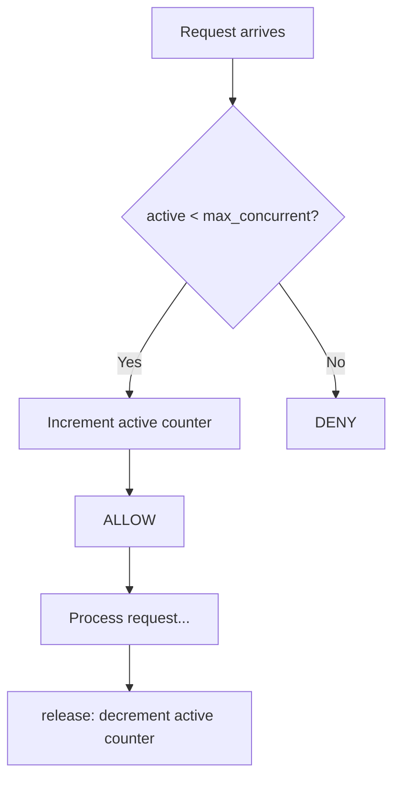

# Concurrency Limiter

Unlike time-based strategies, this limits how many requests are in-flight simultaneously rather than how many arrive per window. Useful for protecting downstream services from being overwhelmed by concurrent load regardless of arrival rate.

## How It Works

1. Maintain a counter of currently active (in-flight) requests.
2. On `allow()`: if `active < max_concurrent`, increment and **allow**.
3. The caller **must** signal completion (via `release()`) when the request finishes, so the counter is decremented.



A context-manager pattern is natural here:

```python
async with limiter.acquire():
    await handle_request()
```

## Parameters

| Name             | Type  | Description                                       |
| ---------------- | ----- | ------------------------------------------------- |
| `max_concurrent` | `int` | Maximum number of simultaneous in-flight requests |

## Trade-offs

**Pros:**

+ Directly prevents overload — caps actual parallel work
+ No time tracking or memory proportional to request volume

**Cons:**

- Requires caller cooperation to release — a missed release leaks a slot permanently (timeout-based auto-release can mitigate this)
- Does not limit request rate — 1000 fast sequential requests per second all pass if each finishes before the next starts

## Comparison

**vs Token Bucket / Fixed Window:** Time-based strategies limit the *rate* of requests regardless of duration. Concurrency Limiter limits the *parallelism* regardless of rate. They address different problems and are often combined.

[View Source on GitHub](https://github.com/smirnoffmg/pure-python-system-design/blob/main/rate_limiter/src/rate_limiter/strategies/concurrency_limiter.py){ .md-button }
