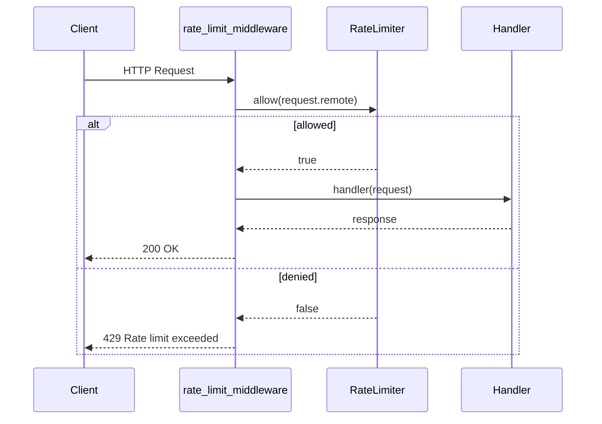

# aiohttp

Rate-limit middleware using client IP with aiohttp's `@web.middleware` decorator.

```bash
pip install aiohttp rate-limiter
```

## Request Flow



## Code

```python
from aiohttp import web

from rate_limiter import RateLimiter, TokenBucketStrategy

limiter = RateLimiter(lambda: TokenBucketStrategy(capacity=10, rate=2))


@web.middleware
async def rate_limit_middleware(request: web.Request, handler):
    key = request.remote or "unknown"
    if not await limiter.allow(key):
        return web.Response(text="Rate limit exceeded", status=429)
    return await handler(request)


async def index(request: web.Request) -> web.Response:
    return web.json_response({"message": "Hello, World!"})


app = web.Application(middlewares=[rate_limit_middleware])
app.router.add_get("/", index)

if __name__ == "__main__":
    web.run_app(app, port=8080)
```

aiohttp is natively async, so the middleware `await`s the limiter directly — no `asyncio.run()` bridge needed.

[View Source on GitHub](https://github.com/smirnoffmg/pure-python-system-design/blob/main/rate_limiter/examples/aiohttp_example.py){ .md-button }
