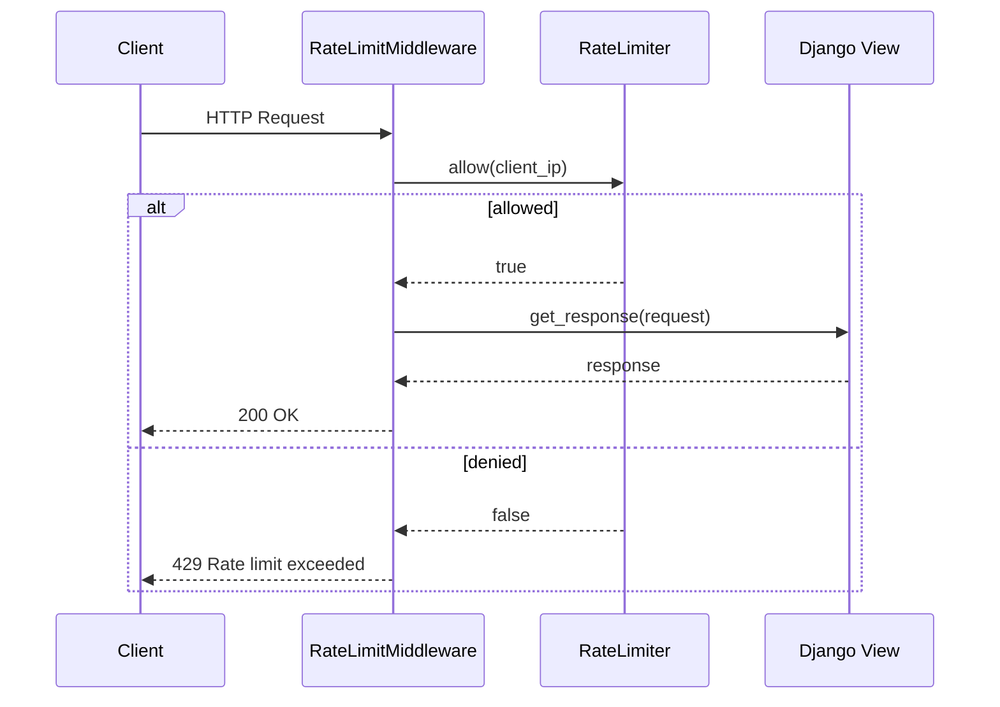

# Django

Rate-limit middleware using client IP with Django 4.1+ async middleware support.

```bash
pip install django rate-limiter
```

Add to `settings.py`:

```python
MIDDLEWARE = [
    # ...
    "examples.django_example.RateLimitMiddleware",
]
```

## Request Flow



## Code

```python
import asyncio

from django.http import HttpRequest, HttpResponse, JsonResponse

from rate_limiter import RateLimiter, TokenBucketStrategy

limiter = RateLimiter(lambda: TokenBucketStrategy(capacity=10, rate=2))


def get_client_ip(request: HttpRequest) -> str:
    forwarded = request.META.get("HTTP_X_FORWARDED_FOR")
    if forwarded:
        return forwarded.split(",")[0].strip()
    return request.META.get("REMOTE_ADDR", "unknown")


class RateLimitMiddleware:
    """Async-compatible Django middleware."""

    def __init__(self, get_response):
        self.get_response = get_response

    async def __call__(self, request: HttpRequest) -> HttpResponse:
        key = get_client_ip(request)
        if not await limiter.allow(key):
            return JsonResponse({"error": "Rate limit exceeded"}, status=429)

        response = self.get_response(request)
        if asyncio.iscoroutine(response):
            response = await response
        return response
```

Extracts the real client IP from `X-Forwarded-For` (common behind reverse proxies) with a fallback to `REMOTE_ADDR`.

[View Source on GitHub](https://github.com/smirnoffmg/pure-python-system-design/blob/main/rate_limiter/examples/django_example.py){ .md-button }
