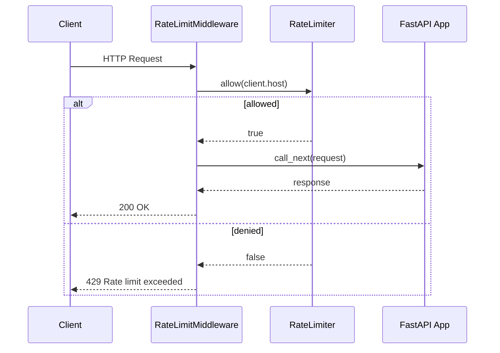

# FastAPI

Rate-limit middleware using client IP with FastAPI and Starlette's `BaseHTTPMiddleware`.

```bash
pip install fastapi uvicorn rate-limiter
```

## Request Flow



## Code

```python
from fastapi import FastAPI, Request, Response
from starlette.middleware.base import BaseHTTPMiddleware

from rate_limiter import RateLimiter, TokenBucketStrategy

app = FastAPI()
limiter = RateLimiter(lambda: TokenBucketStrategy(capacity=10, rate=2))


class RateLimitMiddleware(BaseHTTPMiddleware):
    async def dispatch(self, request: Request, call_next):
        key = request.client.host if request.client else "unknown"
        if not await limiter.allow(key):
            return Response("Rate limit exceeded", status_code=429)
        return await call_next(request)


app.add_middleware(RateLimitMiddleware)


@app.get("/")
async def index():
    return {"message": "Hello, World!"}
```

The middleware intercepts every request, extracts the client IP from `request.client.host`, and checks the limiter before forwarding to the application.

[View Source on GitHub](https://github.com/smirnoffmg/pure-python-system-design/blob/main/rate_limiter/examples/fastapi_example.py){ .md-button }
