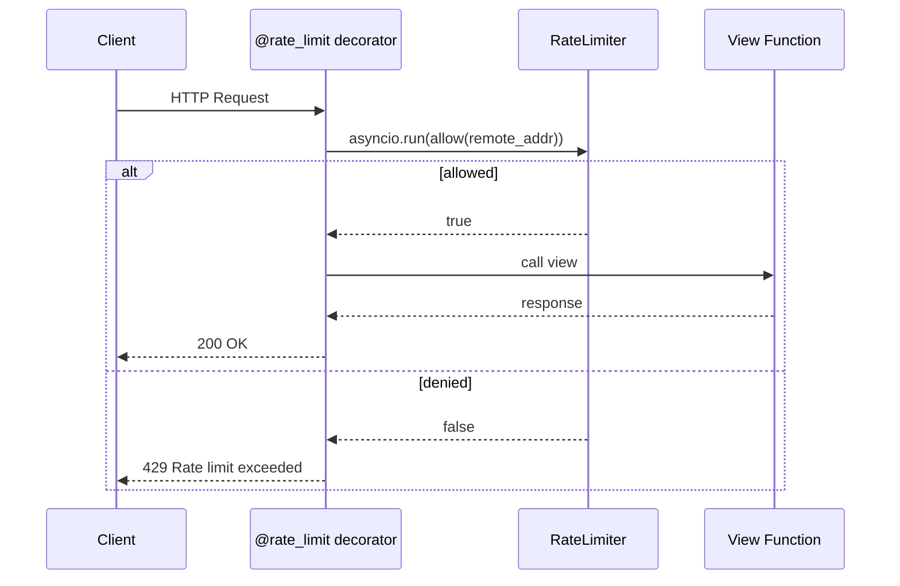

# Flask

Rate-limit decorator using client IP with Flask. Since Flask is synchronous, the async limiter runs via `asyncio.run()`.

```bash
pip install flask rate-limiter
```

## Request Flow



## Code

```python
import asyncio
from functools import wraps

from flask import Flask, abort, jsonify, request

from rate_limiter import RateLimiter, TokenBucketStrategy

app = Flask(__name__)
limiter = RateLimiter(lambda: TokenBucketStrategy(capacity=10, rate=2))


def rate_limit(f):
    @wraps(f)
    def wrapper(*args, **kwargs):
        key = request.remote_addr or "unknown"
        if not asyncio.run(limiter.allow(key)):
            abort(429, description="Rate limit exceeded")
        return f(*args, **kwargs)

    return wrapper


@app.get("/")
@rate_limit
def index():
    return jsonify(message="Hello, World!")


if __name__ == "__main__":
    app.run(port=8080)
```

Uses a decorator pattern instead of middleware — apply `@rate_limit` to individual routes for selective rate limiting.

[View Source on GitHub](https://github.com/smirnoffmg/pure-python-system-design/blob/main/rate_limiter/examples/flask_example.py){ .md-button }
