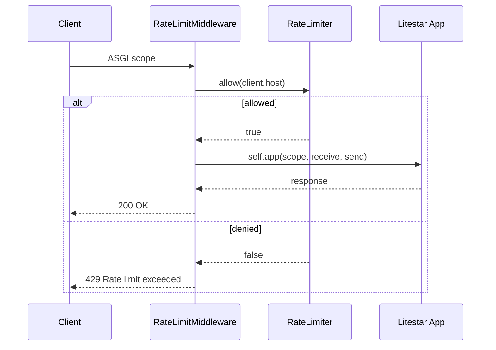

# Litestar

Rate-limit middleware using client IP with Litestar's ASGI middleware base class.

```bash
pip install litestar uvicorn rate-limiter
```

## Request Flow



## Code

```python
from litestar import Litestar, Request, Response, get
from litestar.middleware.base import AbstractMiddleware
from litestar.types import Receive, Scope, Send

from rate_limiter import RateLimiter, TokenBucketStrategy

limiter = RateLimiter(lambda: TokenBucketStrategy(capacity=10, rate=2))


class RateLimitMiddleware(AbstractMiddleware):
    async def __call__(self, scope: Scope, receive: Receive, send: Send) -> None:
        if scope["type"] != "http":
            await self.app(scope, receive, send)
            return

        request = Request(scope)
        key = request.client.host if request.client else "unknown"

        if not await limiter.allow(key):
            response = Response("Rate limit exceeded", status_code=429)
            await response(scope, receive, send)
            return

        await self.app(scope, receive, send)


@get("/")
async def index() -> dict:
    return {"message": "Hello, World!"}


app = Litestar(route_handlers=[index], middleware=[RateLimitMiddleware])
```

Operates at the ASGI level — non-HTTP scopes (like websocket) are passed through without rate limiting.

[View Source on GitHub](https://github.com/smirnoffmg/pure-python-system-design/blob/main/rate_limiter/examples/litestar_example.py){ .md-button }
