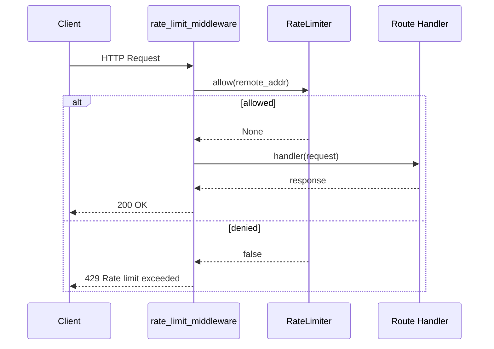

# Sanic

Rate-limit middleware using client IP with Sanic's request middleware hook.

```bash
pip install sanic rate-limiter
```

## Request Flow



## Code

```python
from sanic import Sanic, json
from sanic.request import Request
from sanic.response import text

from rate_limiter import RateLimiter, TokenBucketStrategy

app = Sanic("RateLimitedApp")
limiter = RateLimiter(lambda: TokenBucketStrategy(capacity=10, rate=2))


@app.middleware("request")
async def rate_limit_middleware(request: Request):
    key = request.remote_addr or request.ip or "unknown"
    if not await limiter.allow(key):
        return text("Rate limit exceeded", status=429)


@app.get("/")
async def index(request: Request):
    return json({"message": "Hello, World!"})


if __name__ == "__main__":
    app.run(host="0.0.0.0", port=8080)
```

Sanic request middleware returns `None` to continue or a `Response` to short-circuit — returning the 429 response stops the request before it reaches the handler.

[View Source on GitHub](https://github.com/smirnoffmg/pure-python-system-design/blob/main/rate_limiter/examples/sanic_example.py){ .md-button }
