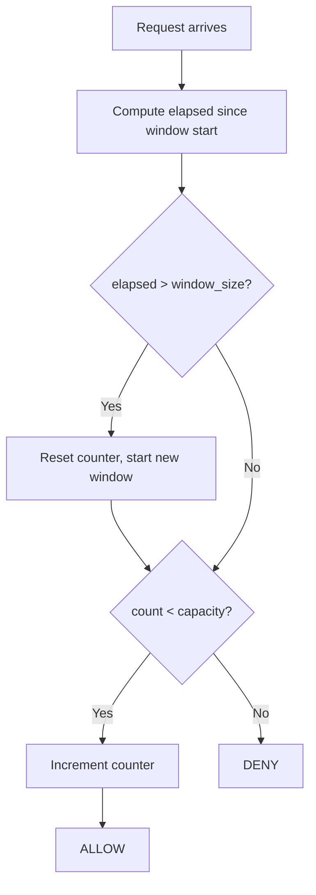

# Fixed Window

Divides time into fixed-size windows and counts requests within each window. When a new window begins, the counter resets to zero.

## How It Works

1. Compute elapsed time since the current window started.
2. If `elapsed > window_size`, reset the counter and start a new window.
3. If `count < capacity`, increment the counter and **allow**.
4. Otherwise, **deny**.

## Parameters

| Name          | Type  | Description                                   |
| ------------- | ----- | --------------------------------------------- |
| `capacity`    | `int` | Maximum number of requests allowed per window |
| `window_size` | `int` | Window duration in seconds                    |

## Trade-offs

**Pros:**

+ Simplest to understand and implement — one counter, one timestamp
+ O(1) time and memory per request

**Cons:**

- Boundary burst problem: a client can send `capacity` requests at the end of one window and `capacity` more at the start of the next, achieving 2x the intended rate across the boundary
- Counter resets abruptly, which can cause traffic spikes at window transitions

## Comparison

**vs Sliding Window Counter:** Sliding Window Counter smooths the boundary problem by weighting the previous window's count, at the cost of a slightly more complex calculation. Fixed Window is appropriate when simplicity matters and the boundary burst is acceptable.

[View Source on GitHub](https://github.com/smirnoffmg/pure-python-system-design/blob/main/rate_limiter/src/rate_limiter/strategies/fixed_window.py){ .md-button }
