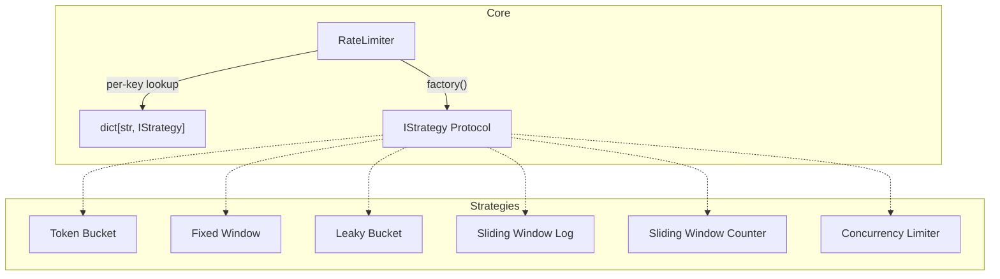

# Rate Limiter

Pure Python rate limiter with pluggable strategies — because nothing says "I understand distributed systems" like reinventing the wheel with `asyncio.Lock`.

[View Source on GitHub](https://github.com/smirnoffmg/pure-python-system-design/tree/main/rate_limiter){ .md-button }

## Quick Start

```python
from rate_limiter import RateLimiter, TokenBucketStrategy

limiter = RateLimiter(lambda: TokenBucketStrategy(capacity=10, rate=2))

# Per-key rate limiting
allowed = await limiter.allow("client-192.168.1.1")  # True
```

## Architecture

The rate limiter uses the **Strategy pattern**: a single `RateLimiter` manages per-key buckets, each backed by a pluggable strategy that implements the `IStrategy` protocol.



The `RateLimiter` lazily creates one strategy instance per key on first access. The strategy factory is a callable you provide at construction time — swap algorithms without touching the rest of your code.

```python
class RateLimiter:
    def __init__(self, strategy_factory: Callable[[], IStrategy]):
        self._strategy_factory = strategy_factory
        self._buckets: dict[str, IStrategy] = {}

    async def allow(self, key: str) -> bool:
        if key not in self._buckets:
            self._buckets[key] = self._strategy_factory()
        return await self._buckets[key].allow()
```

## Strategy Comparison

| Strategy                                            | Time | Memory | Accuracy            | Bursts                     | Boundary Issue    |
| --------------------------------------------------- | ---- | ------ | ------------------- | -------------------------- | ----------------- |
| [Token Bucket](token-bucket.md)                     | O(1) | O(1)   | Exact               | Allowed (up to capacity)   | None              |
| [Fixed Window](fixed-window.md)                     | O(1) | O(1)   | Exact within window | Allowed at boundary        | 2x burst at edges |
| [Leaky Bucket](leaky-bucket.md)                     | O(1) | O(1)   | Exact               | Rejected                   | None              |
| [Sliding Window Log](sliding-window-log.md)         | O(n) | O(n)   | Perfect             | Smooth                     | None              |
| [Sliding Window Counter](sliding-window-counter.md) | O(1) | O(1)   | Approximate         | Smooth                     | Negligible        |
| [Concurrency Limiter](concurrency-limiter.md)       | O(1) | O(1)   | Exact               | N/A (concurrent, not rate) | N/A               |

## Constraints

- **Dependencies**: None — pure Python 3.12+ and `asyncio`
- **Testing**: pytest + pytest-asyncio
- **Code Quality**: Type-annotated, protocol-driven
