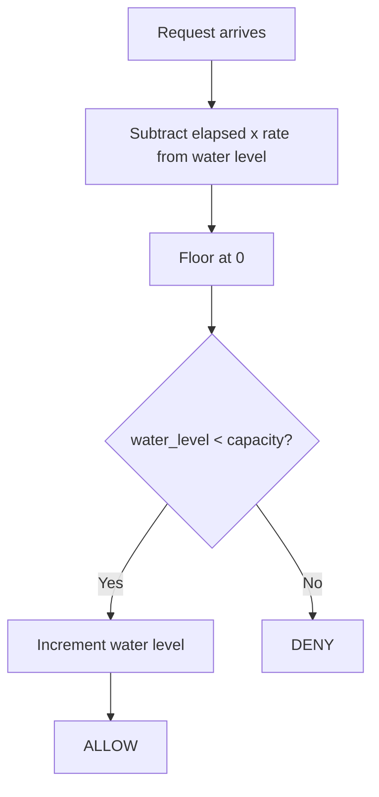

# Leaky Bucket

Incoming requests fill the bucket. The bucket drains (leaks) at a constant rate over time. If the bucket is full when a new request arrives, the request is denied.

## How It Works

1. Compute elapsed time since the last check.
2. Drain: subtract `elapsed * rate` from the water level (min 0).
3. If `water_level < capacity`, increment water level and **allow**.
4. Otherwise, **deny**.

## Parameters

| Name       | Type  | Description                                    |
| ---------- | ----- | ---------------------------------------------- |
| `capacity` | `int` | Maximum number of requests the bucket can hold |
| `rate`     | `int` | Requests drained per second                    |

## Trade-offs

**Pros:**

+ Enforces a smooth, steady output rate regardless of input burstiness — ideal for protecting downstream services
+ O(1) time and memory per request

**Cons:**

- Does not permit bursts at all; even legitimate traffic spikes are rejected once the bucket is full
- A sustained burst fills the bucket instantly, and recovery depends entirely on the drain rate

## Comparison

**vs Token Bucket:** Token Bucket allows bursts up to capacity (spend accumulated tokens at once). Leaky Bucket absorbs bursts and enforces a uniform drain rate. Choose Leaky Bucket when you need strict output smoothing; choose Token Bucket when bursts are acceptable.

[View Source on GitHub](https://github.com/smirnoffmg/pure-python-system-design/blob/main/rate_limiter/src/rate_limiter/strategies/leaky_bucket.py){ .md-button }
