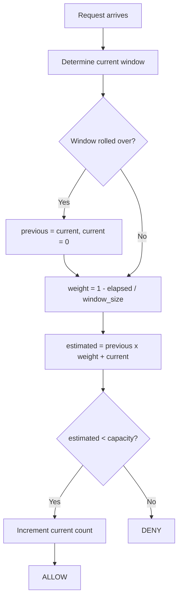

# Sliding Window Counter

A hybrid of Fixed Window and Sliding Window Log. Maintains request counts for the current and previous fixed windows, then estimates the effective count using a weighted average based on how far into the current window the request arrives.

## How It Works

1. Determine which fixed window `now` falls into.
2. If the window has rolled over, rotate: `previous = current`, `current = 0`.
3. Compute the overlap fraction of the previous window: `weight = 1 - (elapsed_in_current_window / window_size)`.
4. Estimated count = `previous_count * weight + current_count`.
5. If estimated count < capacity, increment `current_count` and **allow**.
6. Otherwise, **deny**.

## Parameters

| Name          | Type  | Description                                   |
| ------------- | ----- | --------------------------------------------- |
| `capacity`    | `int` | Maximum number of requests allowed per window |
| `window_size` | `int` | Window duration in seconds                    |

## Trade-offs

**Pros:**

+ Near the accuracy of Sliding Window Log without storing individual timestamps — memory is O(1) (two counters + two timestamps)
+ Smooths out the boundary-burst problem of Fixed Window

**Cons:**

- The count is an estimate, not exact. Under adversarial timing it can be slightly off, but in practice the error is negligible

## Comparison

**vs Sliding Window Log:** Sliding Window Log stores every timestamp (O(n) memory) for perfect accuracy. Sliding Window Counter trades a tiny accuracy loss for constant memory — just two integers and a timestamp.

**vs Fixed Window:** Fixed Window allows up to 2x capacity at the boundary between two windows. The weighted average here prevents that spike.

[View Source on GitHub](https://github.com/smirnoffmg/pure-python-system-design/blob/main/rate_limiter/src/rate_limiter/strategies/sliding_window_counter.py){ .md-button }
