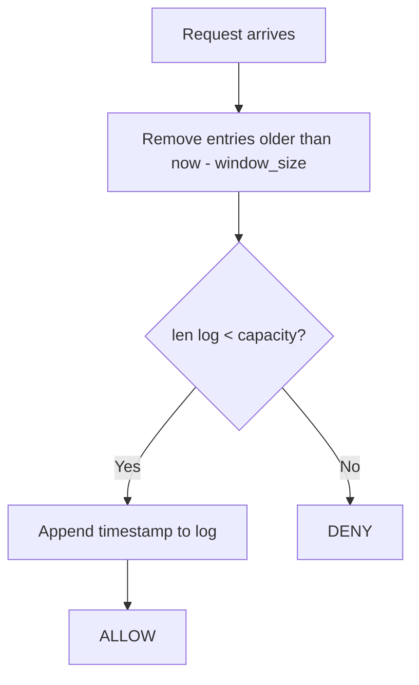

# Sliding Window Log

Tracks the exact timestamp of every request within the current window. On each new request, timestamps older than the window are discarded, and the request is allowed only if the remaining count is below capacity.

## How It Works

1. Remove all entries older than `now - window_size` from the log.
2. If `len(log) < capacity`, append `now` to the log and **allow**.
3. Otherwise, **deny**.

## Parameters

| Name          | Type  | Description                                   |
| ------------- | ----- | --------------------------------------------- |
| `capacity`    | `int` | Maximum number of requests allowed per window |
| `window_size` | `int` | Window duration in seconds                    |

## Trade-offs

**Pros:**

+ Perfectly accurate — no boundary approximation errors
+ Smooth rate enforcement — no burst at window edges

**Cons:**

- Memory grows linearly with request volume (one timestamp per request)
- Cleanup cost on each request is O(n) in the worst case for expired entries, though amortised cost is low with a deque

## Comparison

**vs Fixed Window:** Fixed Window resets its counter at discrete boundaries, which allows up to 2x the intended rate at the boundary. Sliding Window Log eliminates this entirely.

[View Source on GitHub](https://github.com/smirnoffmg/pure-python-system-design/blob/main/rate_limiter/src/rate_limiter/strategies/sliding_window_log.py){ .md-button }
