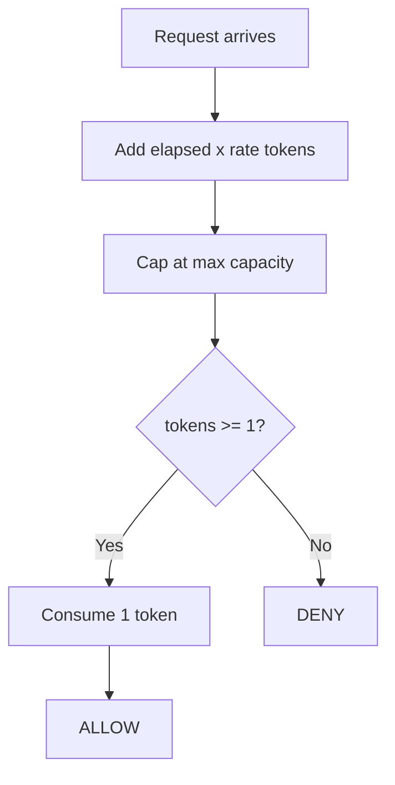

# Token Bucket

Starts with a bucket full of tokens (up to capacity). Each allowed request consumes one token. Tokens are replenished at a fixed rate over time, up to the maximum capacity.

## How It Works

1. Compute elapsed time since the last check.
2. Add `elapsed * rate` tokens to the bucket (capped at capacity).
3. If `tokens >= 1`, consume one token and **allow**.
4. Otherwise, **deny**.

## Parameters

| Name       | Type  | Description                                                       |
| ---------- | ----- | ----------------------------------------------------------------- |
| `capacity` | `int` | Maximum number of tokens the bucket can hold; also the burst size |
| `rate`     | `int` | Tokens added per second                                           |

## Trade-offs

**Pros:**

+ Allows controlled bursts up to capacity while enforcing a long-term average rate
+ O(1) time and memory per request — just arithmetic
+ Smooth refill — no sudden counter resets like Fixed Window

**Cons:**

- Burst size and refill rate are separate knobs that must be tuned together; misconfiguration can allow unwanted spikes

## Comparison

**vs Leaky Bucket:** Token Bucket permits bursts (spend all tokens at once), while Leaky Bucket enforces a steady drain rate and absorbs bursts into the queue. Token Bucket is more permissive for bursty workloads; Leaky Bucket is better for smoothing output rate.

[View Source on GitHub](https://github.com/smirnoffmg/pure-python-system-design/blob/main/rate_limiter/src/rate_limiter/strategies/token_bucket.py){ .md-button }
