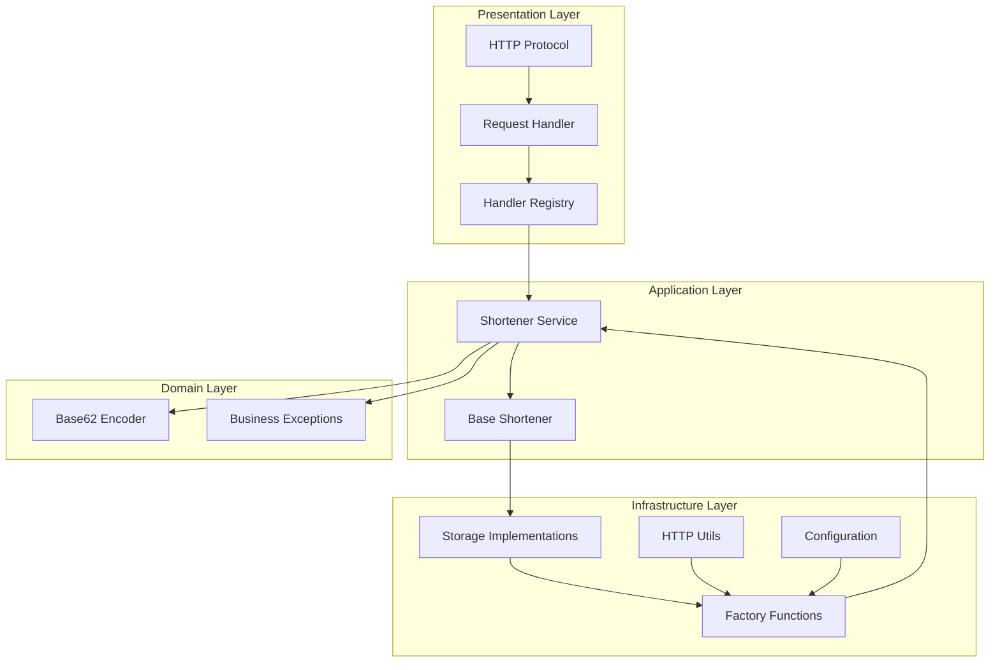

# Architecture

## Layer Responsibilities

| Layer              | Purpose                             | Key Files                                              |
| ------------------ | ----------------------------------- | ------------------------------------------------------ |
| **Presentation**   | HTTP protocol, request routing      | [`api.py`][api], [`handlers.py`][handlers]             |
| **Application**    | Business logic orchestration        | [`service.py`][service]                                |
| **Domain**         | Core business rules                 | [`encoder.py`][encoder], [`exceptions.py`][exceptions] |
| **Infrastructure** | External concerns (storage, config) | [`storage.py`][storage], [`config.py`][config]         |

[api]: https://github.com/smirnoffmg/pure-python-system-design/blob/main/url_shortener/src/url_shortener/presentation/api.py
[handlers]: https://github.com/smirnoffmg/pure-python-system-design/blob/main/url_shortener/src/url_shortener/presentation/handlers.py
[service]: https://github.com/smirnoffmg/pure-python-system-design/blob/main/url_shortener/src/url_shortener/application/service.py
[encoder]: https://github.com/smirnoffmg/pure-python-system-design/blob/main/url_shortener/src/url_shortener/domain/encoder.py
[exceptions]: https://github.com/smirnoffmg/pure-python-system-design/blob/main/url_shortener/src/url_shortener/domain/exceptions.py
[storage]: https://github.com/smirnoffmg/pure-python-system-design/blob/main/url_shortener/src/url_shortener/infrastructure/storage.py
[config]: https://github.com/smirnoffmg/pure-python-system-design/blob/main/url_shortener/src/url_shortener/infrastructure/config.py
