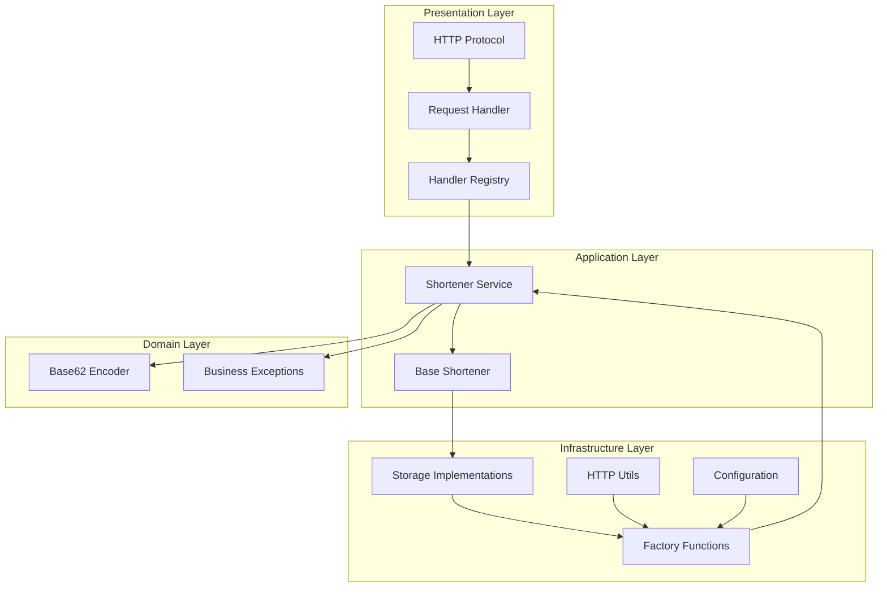

# URL Shortener

Pure Python URL shortener service using `asyncio`.

## Architecture

- **HTTP API**: `asyncio` server with `asyncio.Protocol` implementation
- **Service**: `ShortenerService` (business logic)
- **Storage**: `InMemoryStorage` and `SQLiteStorage`
- **Encoder**: `Base62Encoder`

## Constraints

- **Package Manager**: `uv` only
- **Testing**: pytest suite with httpx
- **Server**: Pure asyncio (no frameworks)
- **Code Quality**: Ruff + mypy
- **Python**: 3.12+

## API

- `POST /shorten` - Create short URL (returns "http://domain/short_code")
- `GET /<short_code>` - Redirect to long URL (returns 302) or 404 if not found
- `GET /health` - Health check endpoint

## Race Conditions

The URL shortener handles several potential race conditions:

### Concurrent URL Shortening

- Multiple requests to shorten the same URL are handled safely
- The storage layer ensures atomic operations for saving mappings
- If two requests try to shorten the same URL, they'll get the same short code

### Storage Operations

- All storage operations (save, get, delete) are atomic
- The InMemoryStorage uses `asyncio.Lock` to synchronize access
- The SQLiteStorage uses transactions for consistency
