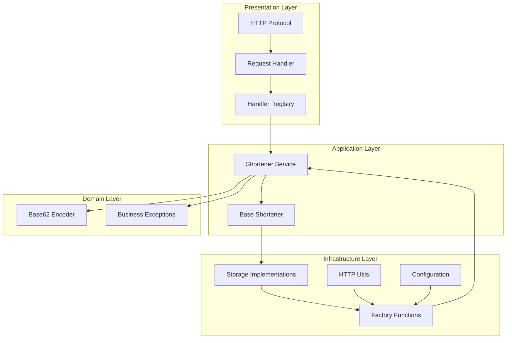

# URL Shortener

Pure Python URL shortener service using `asyncio`.

[View Source on GitHub](https://github.com/smirnoffmg/pure-python-system-design/tree/main/url_shortener){ .md-button }

## Quick Start

### Running the Server

```bash
cd url_shortener
uv run python -m url_shortener
```

Or using Make:

```bash
make run
```

The server starts at `http://localhost:8000` by default.

### Testing the API

**Shorten a URL:**

```bash
curl -X POST http://localhost:8000/shorten \
  -H "Content-Type: application/json" \
  -d '{"url": "https://example.com/very/long/path"}'
```

Response:

```json
{"short_code": "1"}
```

**Redirect to original URL:**

```bash
curl -I http://localhost:8000/1
```

Response:

```
HTTP/1.1 302 Found
Location: https://example.com/very/long/path
```

**Health check:**

```bash
curl http://localhost:8000/health
```

Response:

```json
{"status": "healthy", "service": "url_shortener"}
```

## Configuration

Configuration is loaded from environment variables:

| Variable | Default | Description |
|----------|---------|-------------|
| `URL_SHORTENER_HOST` | `localhost` | Server bind address |
| `URL_SHORTENER_PORT` | `8000` | Server port |
| `URL_SHORTENER_WORKERS` | `1` | Number of workers |
| `URL_SHORTENER_STORAGE` | `memory` | Storage type: `memory` or `sqlite` |
| `URL_SHORTENER_DB_PATH` | `:memory:` | SQLite database path |

**Example with SQLite persistence:**

```bash
URL_SHORTENER_STORAGE=sqlite \
URL_SHORTENER_DB_PATH=./urls.db \
uv run python -m url_shortener
```

## Architecture



### Layer Responsibilities

| Layer | Purpose | Key Files |
|-------|---------|-----------|
| **Presentation** | HTTP protocol, request routing | [`api.py`][api], [`handlers.py`][handlers] |
| **Application** | Business logic orchestration | [`service.py`][service] |
| **Domain** | Core business rules | [`encoder.py`][encoder], [`exceptions.py`][exceptions] |
| **Infrastructure** | External concerns (storage, config) | [`storage.py`][storage], [`config.py`][config] |

[api]: https://github.com/smirnoffmg/pure-python-system-design/blob/main/url_shortener/src/url_shortener/presentation/api.py
[handlers]: https://github.com/smirnoffmg/pure-python-system-design/blob/main/url_shortener/src/url_shortener/presentation/handlers.py
[service]: https://github.com/smirnoffmg/pure-python-system-design/blob/main/url_shortener/src/url_shortener/application/service.py
[encoder]: https://github.com/smirnoffmg/pure-python-system-design/blob/main/url_shortener/src/url_shortener/domain/encoder.py
[exceptions]: https://github.com/smirnoffmg/pure-python-system-design/blob/main/url_shortener/src/url_shortener/domain/exceptions.py
[storage]: https://github.com/smirnoffmg/pure-python-system-design/blob/main/url_shortener/src/url_shortener/infrastructure/storage.py
[config]: https://github.com/smirnoffmg/pure-python-system-design/blob/main/url_shortener/src/url_shortener/infrastructure/config.py

## Code Examples

### Base62 Encoder

The encoder converts sequential IDs to short, URL-safe strings:

```python
from url_shortener.domain import Base62Encoder

encoder = Base62Encoder()

# Encode integers to short codes
encoder.encode(1)      # "1"
encoder.encode(62)     # "10"
encoder.encode(1000)   # "g8"

# Decode back to integers
encoder.decode("g8")   # 1000
```

### Storage Backends

**In-Memory Storage** (default, fast, non-persistent):

```python
from url_shortener.domain import Base62Encoder
from url_shortener.infrastructure import InMemoryStorage

encoder = Base62Encoder()
storage = InMemoryStorage(encoder)

# Create short code
short_code = await storage.create_short_code("https://example.com")

# Retrieve original URL
url = await storage.get_full_url(short_code)
```

**SQLite Storage** (persistent):

```python
from url_shortener.domain import Base62Encoder
from url_shortener.infrastructure import SQLiteStorage

encoder = Base62Encoder()
storage = SQLiteStorage(encoder, db_path="./urls.db")

# Same interface as InMemoryStorage
short_code = await storage.create_short_code("https://example.com")
```

### Using the Factory

The recommended way to create a configured shortener:

```python
from url_shortener.domain import Base62Encoder
from url_shortener.infrastructure.config import Config
from url_shortener.infrastructure.factory import create_shortener

config = Config.from_env()
encoder = Base62Encoder()
shortener = create_shortener(config, encoder)

# Use the shortener
short_code = await shortener.create_short_code("https://example.com")
original = await shortener.get_full_url(short_code)
```

## API Reference

### POST /shorten

Creates a short code for a URL.

**Request:**

```http
POST /shorten HTTP/1.1
Content-Type: application/json

{"url": "https://example.com/path"}
```

**Response (201 Created):**

```json
{"short_code": "1"}
```

**Errors:**

| Status | Reason |
|--------|--------|
| 400 | Missing or invalid URL |
| 500 | Internal server error |

### GET /{short_code}

Redirects to the original URL.

**Response (302 Found):**

```http
HTTP/1.1 302 Found
Location: https://example.com/path
```

**Errors:**

| Status | Reason |
|--------|--------|
| 404 | Short code not found |

### GET /health

Health check endpoint.

**Response (200 OK):**

```json
{"status": "healthy", "service": "url_shortener"}
```

## Constraints

- **Package Manager**: `uv` only
- **Testing**: pytest with coverage
- **Server**: Pure asyncio (no frameworks)
- **Code Quality**: Ruff + mypy (strict)
- **Python**: 3.12+

## Race Condition Handling

### Concurrent URL Shortening

The storage layer handles concurrent requests safely:

```python
# InMemoryStorage uses asyncio.Lock
async with self.lock:
    if full_url in self.full_x_short:
        return self.full_x_short[full_url]  # Return existing
    # ... create new mapping
```

- Multiple requests for the same URL return the same short code
- Atomic operations prevent duplicate entries

### SQLite Transactions

SQLite storage uses transactions for consistency:

```python
with self.db_manager.get_connection() as conn:
    cursor = conn.execute("SELECT id FROM url_mapping WHERE full_url = ?", (url,))
    row = cursor.fetchone()
    if row:
        return self.encoder.encode(row[0])
    # ... insert if not exists
    conn.commit()
```

## Running Tests

```bash
cd url_shortener

# Run all tests
make test

# Run with coverage
uv run pytest --cov=src --cov-report=html

# Run benchmarks
make benchmark
```
