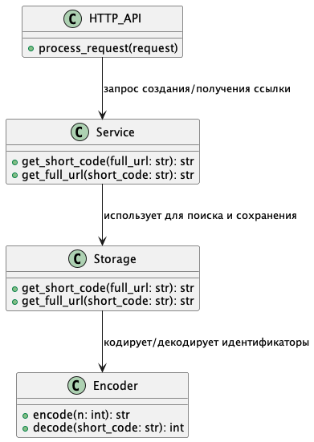
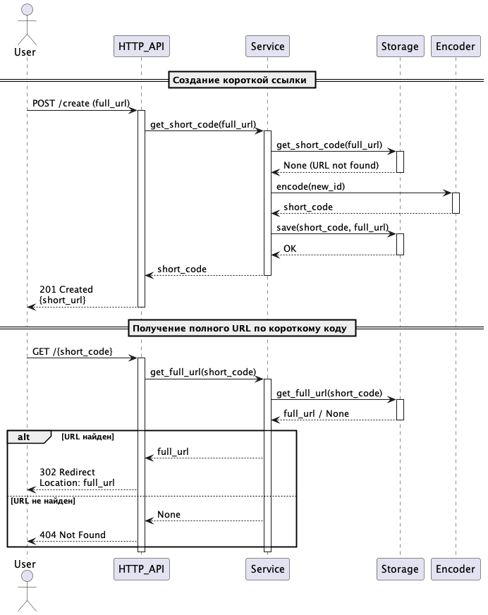

# Сокращатель ссылок на чистом Python

Решаем классическую задачу на проектирование систем, используя только Python 3.12+, отвагу и настойчивость.

# План работ

- Сбор требований
- Проектирование решения
- Написание тестов
- Написание кода
- Анализ результатов

# Сбор требований

## Функциональные требования

- **Редирект по короткой ссылке:**  
    При обращении к короткой ссылке, существующей в базе данных, сервер возвращает HTTP статус **302 Redirect** с указанием полного URL для перенаправления.
- **Обработка несуществующих коротких ссылок:**  
    Если короткая ссылка отсутствует в базе, сервер возвращает HTTP статус **404 Not Found**.
- **Создание короткой ссылки:**  
    При запросе на создание новой короткой ссылки сервер возвращает HTTP статус **201 Created** с телом ответа, содержащим сгенерированную короткую ссылку.

## Нефункциональные требования

- **Валидация HTTP-запросов:**  
    Все входящие запросы должны проходить проверку корректности (валидность формата URL, корректность HTTP-методов, наличие необходимых заголовков и параметров).
- **Производительность и масштабируемость:**  
    Система должна справляться с нагрузкой не менее **1000 запросов в секунду** (RPS).
- **Отказоустойчивость:**  
    При временных сбоях система должна корректно обрабатывать ошибки и не приводить к потере данных.
- **Расширяемость:**  
    Архитектура должна позволять легко добавлять новые функциональные возможности (например, статистику использования или ограничение по времени жизни ссылок).

# Проектирование решения

В данном разделе мы опишем ключевые компоненты и архитектурные решения системы. Особое внимание уделим разделению ответственности между модулями и объясним, как именно будет работать каждый из них.

## Архитектурный обзор

Система будет состоять из следующих компонентов:

- **Encoder** — отвечает за преобразование числовых идентификаторов в короткие строки и обратно.
- **Storage** — хранит мэппинг между короткими кодами и длинными URL.
- **Service** — реализует бизнес-логику создания и поиска коротких ссылок.
- **HTTP API** — интерфейс, принимающий запросы от клиентов и возвращающий ответы.



Эта архитектура основана на принципах однозначного разделения ответственности ("S" из SOLID) и позволяет достаточно легко расширять функциональность.

## Поток обработки запроса



## Encoder

- Задача: кодировать число (уникальный идентификатор URL) в короткий читаемый код и декодировать обратно.
- Используемая схема: base62 (цифры + строчные и заглавные буквы), чтобы минимизировать длину кода.
- Интерфейс: асинхронные методы `encode(n: int) -> str` и `decode(short_code: str) -> int`.

Принимает на вход число, выдаёт на выход короткую строку. 

```python
from abc import ABC, abstractmethod

class BaseEncoder(ABC):
    @abstractmethod
    async def encode(self, n: int) -> str:
        """Преобразует число в короткую строку."""
        pass

    @abstractmethod
    async def decode(self, short_code: str) -> int:
        """Преобразует короткую строку обратно в число."""
        pass

```

## Storage

- Отвечает за сохранение и получение данных.
- Интерфейс должен позволять:
    - Получать короткий код по полному URL.
    - Получать полный URL по короткому коду.
- Возможна реализация на разных технологиях (in-memory, база данных, кеш).
- Стартуем с простой in-memory реализации для удобства отладки.

Начнём с описания базового класса.

```python
from abc import ABC, abstractmethod

class BaseStorage(ABC):
	@abstracmethod
	async def get_short_code(self, full_url: str) -> str:...
	
	@abstracmethod
	async def get_full_url(self, short_code: str) -> str | None:...

```

Одна из самых простых реализаций in-memory storage может выглядеть вот так:

## Service

- Центральный модуль бизнес-логики.
- Основные сценарии:
    - Создание короткой ссылки: если URL новый — генерируется уникальный ID, кодируется и сохраняется. Если URL уже есть — возвращается существующий код.
    - Получение полного URL по короткому коду: возвращает URL или сигнализирует об ошибке.
- Здесь же можно добавить кэширование, логи и статистику.

```python
from abc import ABC, abstractmethod

class BaseService(ABC):
    @abstractmethod
    async def get_short_code(self, full_url: str) -> str:
        """Создаёт (если нужно) и возвращает короткий код для полного URL."""
        pass
    
    @abstractmethod
    async def get_full_url(self, short_code: str) -> str | None:
        """Возвращает полный URL по короткому коду или None, если не найден."""
        pass
```

## HTTP API

Внешний интерфейс нашей системы, который принимает запросы от клиентов и возвращает соответствующие HTTP-ответы. 
Основные функции:

- Приём и валидация HTTP-запросов. Проверка корректности метода, заголовков и параметров.
- Вызов бизнес-логики сервиса для создания или получения ссылок.
- Формирование правильных HTTP-ответов с нужными статусами и заголовками (например, 201, 302, 404).
- Асинхронная обработка запросов для поддержки высокой нагрузки.

Поскольку по условию задачи мы используем только стандартный Python без сторонних веб-фреймворков, реализация HTTP-сервера будет основана на `asyncio.Protocol`.

Основные моменты реализации:

- Парсинг запроса вручную — чтение заголовков, метода, URI и тела.
- Обработка методов:
  - POST /create — создание короткой ссылки (ожидается тело с полным URL).
  - GET /{short_code} — получение полной ссылки и редирект.
- Валидация URL (например, при создании).
- Асинхронный вызов методов сервиса.
- Формирование корректных HTTP-статусов и заголовков:
  - `201 Created` — при успешном создании короткой ссылки.
  - `302 Found` — при редиректе на полный URL.
  - `404 Not Found` — при отсутствии ссылки.
  - `400 Bad Request`**** — при ошибках в запросе.

```python
from abc import ABC, abstractmethod
from typing import Any

class BaseHTTPAPI(ABC):
    @abstractmethod
    async def handle_create(self, full_url: str) -> dict[str, Any]:
        """
        Обработка запроса на создание короткой ссылки.
        
        :param full_url: Полный URL, который надо сократить.
        :return: Словарь с результатом, например {'short_code': str}.
        """
        pass

    @abstractmethod
    async def handle_redirect(self, short_code: str) -> str | None:
        """
        Обработка запроса редиректа по короткому коду.
        
        :param short_code: Короткий код из запроса.
        :return: Полный URL для редиректа или None, если код не найден.
        """
        pass

    @abstractmethod
    async def process_request(self, raw_request: bytes) -> bytes:
        """
        Получает сырые данные запроса (HTTP), парсит их, вызывает соответствующие обработчики и формирует ответ.
        
        :param raw_request: Сырые байты HTTP-запроса.
        :return: Сырые байты HTTP-ответа.
        """
        pass
```

Запуск сервера будет выглядеть примерно так:

```python
async def main(service: BaseService, host="127.0.0.1", port=8080):
    loop = asyncio.get_running_loop()
    server = await loop.create_server(lambda: HTTPProtocol(service), host=host, port=port)
    print(f"Serving on {host}:{port}")
    await server.serve_forever()
```

## Дополнительные архитектурные решения

- **Асинхронность:** все операции реализованы асинхронно для увеличения производительности и обработки высокой нагрузки.
- **Типы данных:** методы снабжены типизацией для повышения читаемости и возможностей статического анализа.
- **Обработка ошибок:** в сервисе и API предусмотрена обработка ошибок с возвратом корректных HTTP-статусов.
- **Тестируемость:** архитектура ориентирована на простое покрытие модульными тестами благодаря использованию интерфейсов.

# Написание тестов

## Кодирование и декодирование (Encoder)

- Проверка корректного преобразования чисел в короткие коды и обратно.
- Обработка граничных значений (0, большие числа).

```python
import pytest

@pytest.fixture
def encoder() -> BaseEncoder:
    return BaseEncoder() # пример, здесь будет реальная имплементация


@pytest.mark.asyncio
@pytest.mark.parametrize("number", [0, 1, 10, 61, 62, 12345, 987654321])
async def test_encode_decode(encoder, number):
    encoded = await encoder.encode(number)
    decoded = await encoder.decode(encoded)
    assert decoded == number


@pytest.mark.asyncio
@pytest.mark.parametrize("encoded_value,expected_number", [
    ("0", 0),
    ("1", 1),
    ("Z", 61),
    ("10", 62),
    ("3d7", 12345)
])
async def test_decode_known_values(encoder, encoded_value, expected_number):
    decoded = await encoder.decode(encoded_value)
    assert decoded == expected_number


@pytest.mark.asyncio
@pytest.mark.parametrize("invalid_code", ["abc$", "!!!", "123 ", "\n", "abc\n"])
async def test_decode_invalid_characters_raises(encoder, invalid_code):
    with pytest.raises(ValueError):
        await encoder.decode(invalid_code)


@pytest.mark.asyncio
@pytest.mark.parametrize("large_number", [2**32, 10**12, 10**18])
async def test_encode_decode_large_numbers(encoder, large_number):
    encoded = await encoder.encode(large_number)
    decoded = await encoder.decode(encoded)
    assert decoded == large_number
```

## Хранилище (Storage)

- Сохранение и получение соответствий между полным URL и коротким кодом.
- Поведение при отсутствии данных.
- **Проверка на race conditions:**  
  - Одновременные операции записи и чтения.  
  - Убедиться в корректности при конкурентном доступе (важно для многопоточных и асинхронных реализаций).

## Сервис (Service)

- Корректное создание новой короткой ссылки и возврат существующей для уже сохранённого URL.
- Получение полного URL по короткому коду.
- Обработка отсутствующих кодов.
- **Проверка на race conditions:**  
  - Параллельные запросы на сокращение одного и того же URL не должны создавать дубликатов.  
  - Консистентность данных и отсутствие потерь.

## Внешний интерфейс (HTTP API)

- Корректное создание коротких ссылок (`POST /create`).
- Корректный редирект по короткому коду (`GET /{short_code}`).
- Обработка ошибок (404, 400).
- Валидация входных данных.

## Нефункциональные требования

- Производительность и устойчивость к нагрузке (не менее 1000 RPS).
- Отказоустойчивость и корректная обработка ошибок.